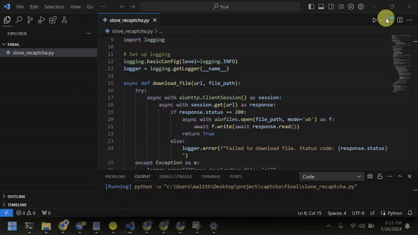

# 🤖 Automated reCAPTCHA Solver

A Python script that provides an automated solution for solving reCAPTCHA challenges using audio recognition. No CAPTCHAs were harmed in the making of this project. 😉

## ❗ Important Note

Windows might detect this Python script as a virus. This is not correct. You can check the source code. 😊

## ✨ Features

- 🔄 Automates reCAPTCHA solving process
- 🔊 Uses audio challenges instead of visual ones
- 🎙️ Implements speech recognition for transcription

## 🖼️ Demo



## 🛠️ Setup

1. Clone the repository:
    ```bash
    git clone https://github.com/malithonline/recaptchasolver.git
    cd recaptcha-solver
    ```

2. Install dependencies:
    ```bash
    pip install -r requirements.txt
    ```

3. Install additional system dependencies:
    - FFmpeg (for audio processing)
    - Google Chrome or Chromium browser

## 📝 Usage

Run the script with:
    ```bash
    python solve_recaptcha.py
    ```
    The script will launch a browser, navigate to the reCAPTCHA demo page, and attempt to solve the challenge.

## 💻 Source Code

This repository contains the full source code of the reCAPTCHA solver script. Feel free to explore and understand how it works!

## 🤝 Contributing

Contributions to improve the script or add new features are welcome. Please feel free to submit a Pull Request.

## ⚠️ Disclaimer

This tool is for educational purposes only. Using automated systems to solve CAPTCHAs may violate terms of service of some websites. Use responsibly and in accordance with applicable laws and regulations.
It's not about breaking systems, but understanding them.

## 📄 License

This project is licensed under the MIT License - see the LICENSE file for details.

## 📞 Contact

If you have any questions, feel free to reach out:

- Telegram: [@malithonline](https://t.me/malithonline)
- LinkedIn: [@malithonline](https://www.linkedin.com/in/malithonline)
- GitHub: [@malithonline](https://github.com/malithonline)


Made with ❤️ by Malith
